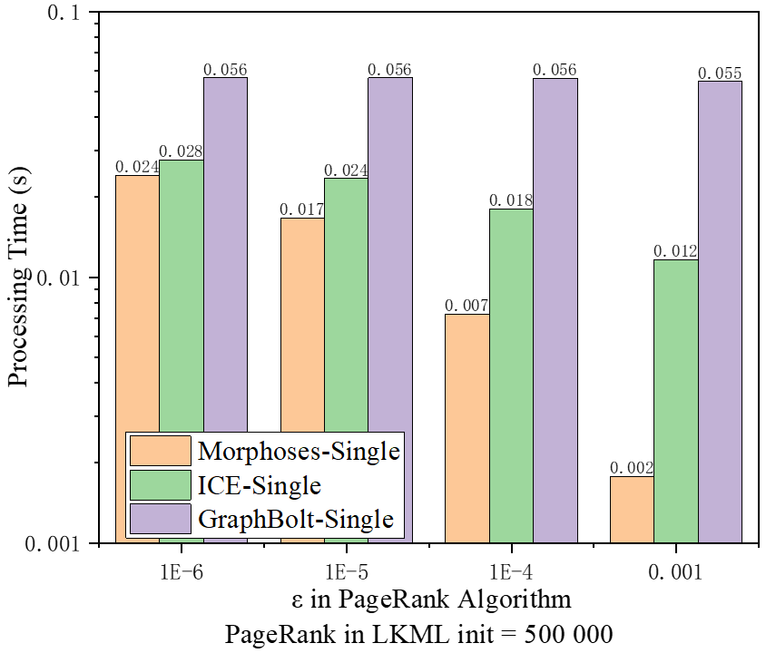
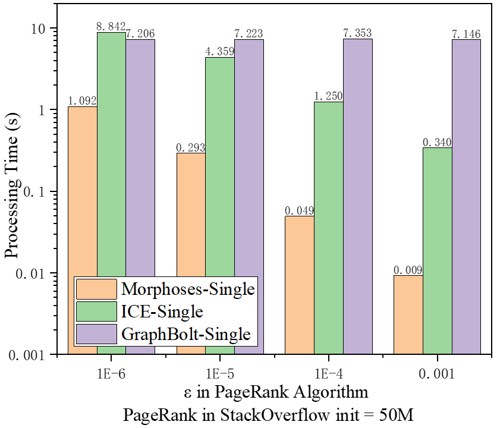
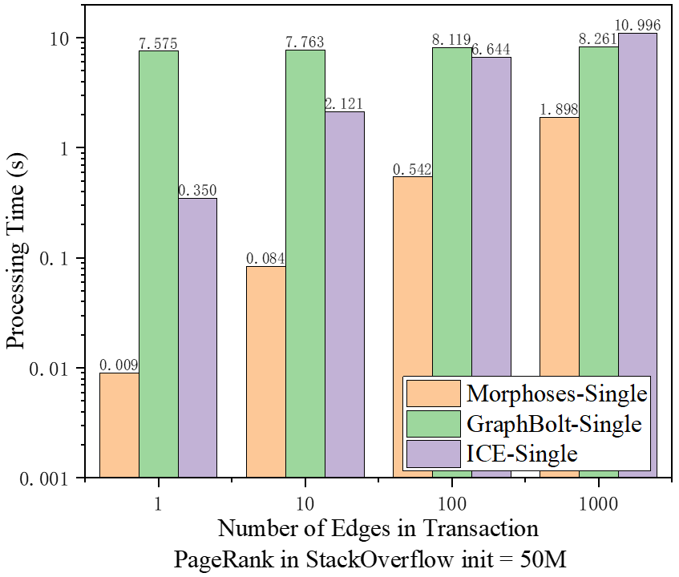
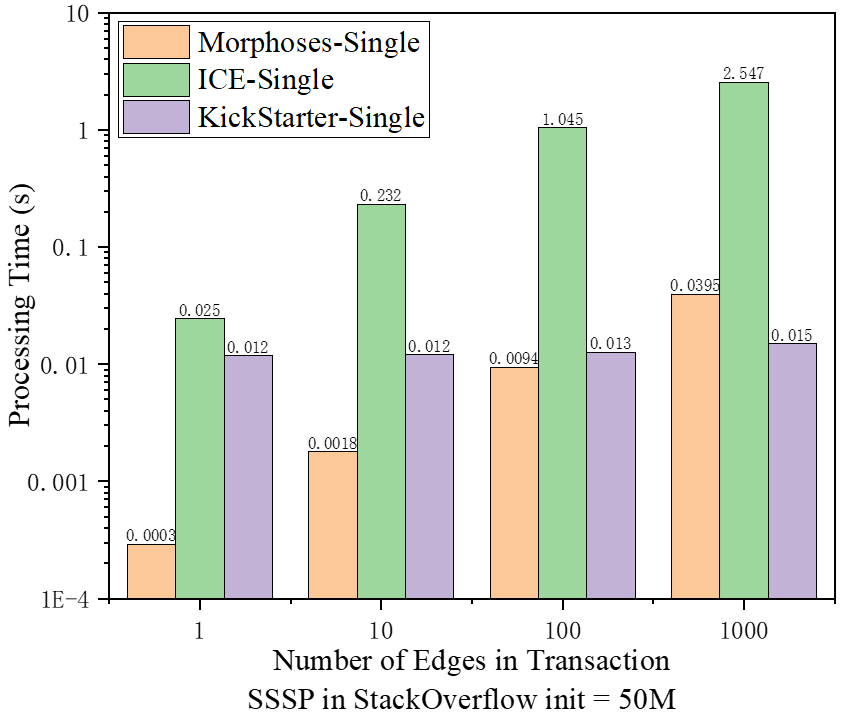

# Morphoses: A General Graph Stream Fine-grained Tracking System at Scale

Morphoses is an efficient graph stream real-time tracking system. She provides quickly reactions to the real-time graph changes of the impact upon different iterative graph algorithms, and provides fine-grained tracking security.[[Read more]](Morphoses_20220620.pdf)

## 1. Introduction

Morphoses is a general graph stream tracking system developed for scalable fine-grained graph stream tracking. Morphoses performs incremental processing based on iterative process retention. Unlike previous methods, it proposes *Vertex State Set* to implement full incremental processing of data structures and iterative algorithms. The vertex state set avoids the complete materialization of the iterative results of the algorithm and unnecessary vertex state scanning. Morphoses can flexibly reuse the history of the previous iteration or the current iteration in the previous frame in both directions. The results are retained to narrow the scope of incremental recalculation. At the same time, Morphoses organizes multiple consecutive graph stream transactions into micro-batches for processing, and uses 
timing multi-version graph storage to parallel computations within micro-batches. Based on this, we propose a divide-and-conquer method to quickly track key transactions that cause results to change.

##  2. Getting Started

### 2.1 Project Organization

The `core/Morphoses/` folder contains the [Morphoses Engine](#3-morphoses-engine), and a [Stream Ingestor](#4-stream-ingestor) module. The application codes (e.g., PageRank, SSSP, etc.) for Morphoses engine can be found in the `apps/` directory. Useful helper files for generating the stream of changes (`tools/generators/streamGenerator.C`), creating the graph inputs in the correct format (`tools/converters/SNAPtoAdjConverter.C` - from Ligra's codebase) are provided.

### 2.2 Requirements
- g++ >= 5.3.0 with support for Cilk Plus.
- [Mimalloc](https://github.com/microsoft/mimalloc) - A fast general purpose memory allocator from Microsoft (version >= 1.6).
    - Use the helper script `install_mimalloc.sh` to install mimalloc.
    - Update the LD_PRELOAD enviroment variable as specified by install_mimalloc.sh script.

**Important: Morphoses requires mimalloc to function correctly and efficiently.**


### 2.3 Compiling and Running the Application

Compilation is done from within `apps` directory. To compile, run
```bash
$   cd apps
$   make -j
```
 The executable takes the following command-line parameters:
 - `-streamPath` : Path to the input stream file or pipe (More information on the input format can be found in [Section 2.4](#24-graph-input-and-stream-input-format)).
 - `-numberOfUpdateBatches` : Optional parameter to specify the number of transactions to be performed. Default is 1.
 - `-nEdges` : Number of edge operations to be processed in a given transaction.
 - `-batchSize` : Number of transactions to package and batch processing for Morphoses engine. Default is 256.
 - `-nWorkers` : Number of threads used in parallel processing of a transaction batch. Default is 1.
 - `-outputFile` : Optional parameter to print the output of a given algorithms.
 - Initial graph file path (More information on the input format can be found in [Section 2.4](#24-graph-input-and-stream-input-format)).

For example,
```bash
$   # Ensure that LD_PRELOAD is set as specified by the install_mimalloc.sh
$   ./PageRank -numberOfUpdateBatches 2 -nEdges 1000 -streamPath ../inputs/sample_edge_operations.txt -outputFile /tmp/output/pr_output ../inputs/sample_graph.adj
$   ./LabelPropagation -numberOfUpdateBatches 3 -nEdges 2000 -streamPath ../inputs/sample_edge_operations.txt -seedsFile ../inputs/sample_seeds_file -outputFile /tmp/output/lp_output ../inputs/sample_graph.adj
$   ./COEM -s -numberOfUpdateBatches 3 -nEdges 2000 -streamPath ../inputs/sample_edge_operations.txt -seedsFile ../inputs/sample_seeds_file -partitionsFile ../inputs/sample_partitions_file -outputFile /tmp/output/coem_output ../inputs/sample_graph.adj
$   ./CF -s -numberOfUpdateBatches 2 -nEdges 10000 -streamPath ../inputs/sample_edge_operations.txt -partitionsFile ../inputs/sample_partitions_file -outputFile /tmp/output/cf_output ../inputs/sample_graph.adj.un
$   ./SSSP -source 0 -numberOfUpdateBatches 1 -nEdges 500 -streamPath ../inputs/sample_edge_operations.txt -outputFile /tmp/output/sssp_output ../inputs/sample_graph.adj
$   ./BFS -source 0 -numberOfUpdateBatches 1 -nEdges 50000 -streamPath ../inputs/sample_edge_operations.txt -outputFile /tmp/output/bfs_output ../inputs/sample_graph.adj
```
Other additional parameters may be required depending on the algorithm. Refer to the `Compute()` function in the application code (`apps/PageRank.C`, `apps/SSSP.C` etc.) for the supported arguments. Additional configurations for the graph ingestor and the graph can be found in [Section 4](#4-stream-ingestor).

### 2.4 Graph Input and Stream Input Format

Morphoses uses weighted graphs, and the input graph should be in the weighted adjacency graph format. It is similar to [adjacency graph format](http://www.cs.cmu.edu/~pbbs/benchmarks/graphIO.html) but with the edge weights following the edges.

For example, a sample graph in SNAP format (weighted edgelist) and weighted adjacency graph format is shown below.

*SNAP format (weighted edgelist):*
```txt
0 1 10
0 2 100
```
*Weighted Adjacency Graph format:*
```txt
WeightedAdjacencyGraph
3
2
0
2
2
1
2
10
100
```
You can use `tools/converter/SNAPtoAdjConverter.C -w` to convert the weighted edgelist to the weighted adjacency graph format as follows:
```bash
$   ./SNAPtoAdjConverter -w inputGraphWeighted.snap inputGraphWeighted.adj
$   # for undirected (symmetric) graphs, use the -s flag
$   ./SNAPtoAdjConverter -s -w inputGraphWeighted.snap inputGraphWeightedUndirected.adj 
```

Each entry in the streaming weighted input file should be of the format `[d/a] source destination edge_data`, where `d` indicates deletion and `a` indicates addition.

*Streaming weighted input file:*
```txt
d   0   1   10
a   1   2   20
```

Morphoses always compiles the program in weighted mode, if applications need to use unweighted graphs, set all edge weights to invalid values, and avoid involving the weight value in application codes.


The edge weight datatype should be defined similar to `apps/SSSP_edgeData.h` by extending the `EdgeDataType` struct defined under `core/graph/edgeDataType.h`. The following functions and variable determine how the edge weight from the input files are transformed and used by the system:
- `createEdgeData(const char *edgeDataString)` - creates the edge data from the character string provided in graph input or streaming input. For example in SSSP, the string "10" is converted to the integer 10 and stored as edge weight. 
- `setEdgeDataFromPtr(EdgeDataType *edgeData)` - performs a deep copy of the passed edge data.
- `del()` - to deallocate any allocated memory.

**Complex edge data**

Graphs with complex edge data are also supported provided that the complex edge data is represented as a single string without spaces. For example, if each edge has `{edge_id, distance, max_speed}` it can be represented in the weighted SNAP format as follows:
```txt
0 1 1_0.3_0.5
0 2 2_1.5_1.68
```

This graph with complex edge data can be converted into the weighted adjacency graph format with `tools/converter/SNAPtoAdjConverter.C` as shown below.
```bash
$   ./SNAPtoAdjConverter -w inputGraphWeighted.snap inputGraphWeighted.adj
$   # for undirected (symmetric) graphs, use the -s flag
$   ./SNAPtoAdjConverter -s -w inputGraphWeighted.snap inputGraphWeightedUndirected.adj 
```

The weighted adjacency graph can then be used in user programs by defining the corresponding `EdgeDataType` struct as discussed above. In the `createEdgeData(const char *edgeDataString)` function, the string can be parsed into the respective datatypes `{long, double, double}` for `{edge_id, distance, max_speed}`.

Edge operations can be streamed through a pipe using `tools/generators/streamGenerator.C`. It takes in the following command-line parameters:
- `-edgeOperationsFile` : Input file containing the edge operations in the format mentioned above.
- `-outputPipe` : Path of the output pipe where the edges are streamed to.

```bash
$   cd tools/generators
$   make streamGenerator
$   ./streamGenerator -edgeOperationsFile ../inputs/sample_edge_operations.txt -outputPipe ../inputs/sample_edge_operations.pipe
```
More details regarding the ingestor can be found in [Section 4](#4-stream-ingestor).

## 3. Morphoses Engine

The Morphoses engine is general for different iterative graph algorithms and uses several common convenient APIs.

### 3.1 Creating Applications using the Morphoses Engine

Morphoses framework ensures that the application code remains oblivious to Morphoses's internal subtleties while still providing fast performance.

So, the application code only needs to express its computation using the following functions. More details regarding these functions can be found in the inline comments of `MorphosesEngine.h`.

#### AggregateValue and VertexValue initialization:
- initializeAggregationValue()
- initializeVertexValue()

Morphoses stores information for each vertex in the form of aggregation values and will be use in different version of the graph. For example in PageRank, the vertex value is its pagerank (`PR`), its out degrees(`outDegree`) and the aggregation value is the sum of `(PR[u]/out_Degree[u])` values from all its inNeighbors. 

#### Edge functions:
- edgeFunction()
- incrementalAggregationValue()

The trivial edge operation `edgeFunction()` starts from the vertex value and ends by modifying the aggregate value of the destination vertex through an edge.

The incremental edge operation is split into 3 phases:
1. Revoke the old source contribution - For example, in PageRank, a vertex `u` adds the value `PR[u]/out_degree[u]` to the aggregation value of all its outNeighbors. Subtracting this value from the aggregated value of v will revoke the contribution of old `u`.
2. Transform the new contribution depending on the edge data - In this step, the source vertex contribution is transformed by the edge property. For example in weighted page rank, the contribution will be multiplied by the edge weight.
3. Aggregating the contribution to the aggregation value.

#### Vertex compute function and determine end of computation:
- computeFunction()
- isVertexValueEqual()

Given an aggregation value, `computeFunction()` computes the vertex value corresponding to this aggregation value.
To replay the computation history, `computeFunction()` is not called when the vertex value has not significantly changed.
In order to detemine the convergence condition, the `isVertexValueEqual()` is used to determine whether the value of vertex has significantly changed compared to its previous value. 
Both these functions do not require CAS or locks.

#### Determine how an edge update affects the source / destination:
- useIncrementalVertexValueRecompute()
- theSameVertexVlaueTheSameMessage()

These functions tell Morphoses some characteristics of the iterative graph algorithm for more optimized performation. `useIncrementalVertexValueRecompute()` returning true means that Morphoses can use the incremental function `incrementalAggregationValue()` to recompute aggregation values. And `theSameVertexVlaueTheSameMessage()` returning true means that Morphoses can confirm same messages derived from same vertex values, thus avoiding unnecessary retransmissions(must be done in some algorithms such as `PR`).

#### Compute function
- compute()

This is the starting point of the application. The Morphoses engine is initialized here with the required configurations and started.

In addition to these functions, the algorithm also needs to define an `Info` class which contains all the global variable/constants required for that application. It should implement the following functions:
- copy()
- processUpdates()
- cleanup()


## 4. Stream Ingestor

The stream ingestor FIFO is specified by `-streamPath`. Edge operations can be written to this FIFO. `-nEdges` specifies the maximum number of edge operations that can be passed to the Morphoses engine in a single batch. The Morphoses engine will continue to receive batches of edges from the stream ingestor until either the stream is closed (when there are no more writers to the FIFO) or when `-numberOfBatches` has been exceeded. If the writing end of the FIFO is not opened, the Morphoses engine (which is the reading end) will block and wait until it is opened. 

There are a few optional flags that can affect the behaviour and determine the validity of the edge operations  passed to the command line parameter `-streamPath`:

- `-fixedBatchSize`: Optional flag to ensure that the batch size is strictly adhered to. If the FIFO does not contain enough edges, the ingestor will block until it has received enough edges specified by `-nEdges` or until the stream is closed. 
- `-enforceEdgeValidity`: Optional flag to ensure that all edge operations in the batch are valid. For example, an edge deletion operation is valid only if the edge to be deleted is present in the graph. In the case of a `simple graph` (explained below), an edge addition operation is valid only if that edge does not currently exist in the graph. Invalid edges are discarded and are not included while counting the number of edges in a batch.
- `-simple`: Optional flag used to ensure that the input graph remains a simple graph (ie. no duplicate edges). The input graph is checked to remove all duplicate edges. Duplicate edges are not allowed within a batch and edge additions are checked to ensure that the edge to be added does not yet exist within the graph.
- `-debug`: Optional flag to print the edges that were determined to be invalid.

## 5. Evaluation
<p float="left">
    
    
      在这里插入图片注释
</p>

<p float="left">
    
    
</p>

Here, we present some evaluation results using two public datasets ([LKML](http://konect.cc/networks/lkml-reply/) & [StackOverflow](http://konect.cc/networks/sx-stackoverflow/)). [LKML](http://konect.cc/networks/lkml-reply/) is a small dataset with 1,096,440 edges and 63,399 vertices, our initial graph has 500,000 edges. While [StackOverflow](http://konect.cc/networks/sx-stackoverflow/) has a larger scale, the entire dataset has 63,497,050 edges and 2,601,977 vertices, and our initial graph is set to 50,000,000 edges.

**PageRank algorithm.** For a particular graph, the efficiency of PageRank algorithm depends heavily on the setting of the convergence parameter `ε`. After the same change in the graph, the more precise convergence parameters, the more difficult it is to recompute all PageRank values. Figure 1 and Figure 2 present the results of such an experiment. In graph streams of [LKML](http://konect.cc/networks/lkml-reply/) and [StackOverflow](http://konect.cc/networks/sx-stackoverflow/), Morphoses achieves an improvement over other state-of-the-art works regardless of whether the value of `ε` is 0.001 or as low as 0.000 001. It should be pointed out that these tests are all performed in a single-thread (`-nWorkers` is 1) setting. For [StackOverflow](http://konect.cc/networks/sx-stackoverflow/), when `ε`=0.001, Morphoses can complete the calculation of one frame in at most 0.01s, which is equivalent to a throughput of 100 transactions per second.

On the other hand, any graph iteration algorithm is affected by the number of edges involved in a single transaction. Figure 3 presents the results of related experiments. By determining `ε`=0.001, we test the effect of different transaction sizes on Morphoses. If the transaction contains multiple concurrently updated edges, the incremental computing benefit of Morphoses decreases due to the large changes in the graph before and after the transaction.

**SSSP algorithm.** Different from PageRank, the SSSP algorithm belongs to the _monotonic algorithm_, and a large number of studies point out that the monotonic graph algorithm can avoid calculations by the dependence of vertex values. Therefore we do not emphasize the performance of Morphoses when dealing with monotonic graph algorithms. In fact, the results in Figure 4 show that when the transaction involves up to 1,000 edges, the performance of Morphoses is not as good as that of KickStarter using the dependent technology.

## 6. Acknowledgements
Some utility functions from [Ligra](https://github.com/jshun/ligra), [GraphBolt](https://github.com/pdclab/graphbolt) and [Problem Based Benchmark Suite](http://www.cs.cmu.edu/~pbbs/index.html) are used as part of this project. We are thankful to them for releasing their source code.


## 7.Authors and Copyright
Morphoses is developed in National Engineering Research Center for Big Data Technology and System, Cluster and Grid Computing Lab, Services Computing Technology and System Lab, School of Computer Science and Technology, Huazhong University of Science and Technology, Wuhan, China.

Copyright (C) 2022, [STCS & CGCL](http://grid.hust.edu.cn/) and [Huazhong University of Science and Technology](https://www.hust.edu.cn/).
